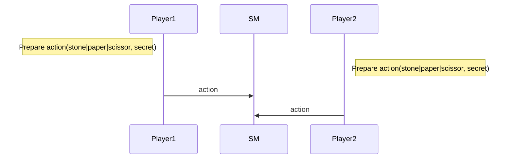
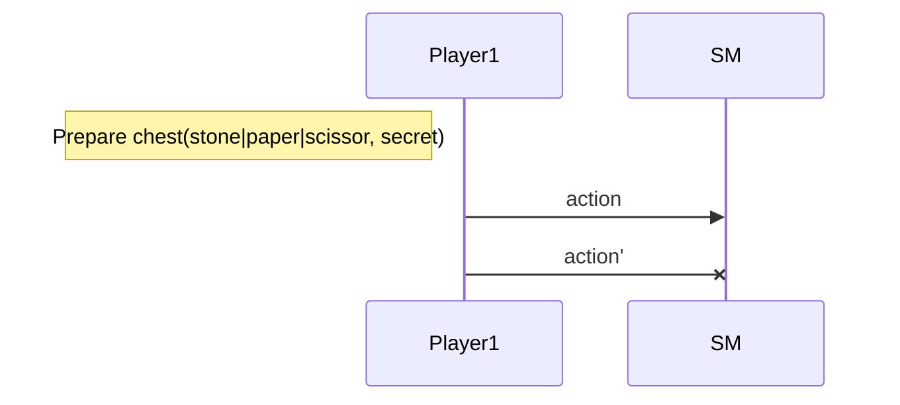
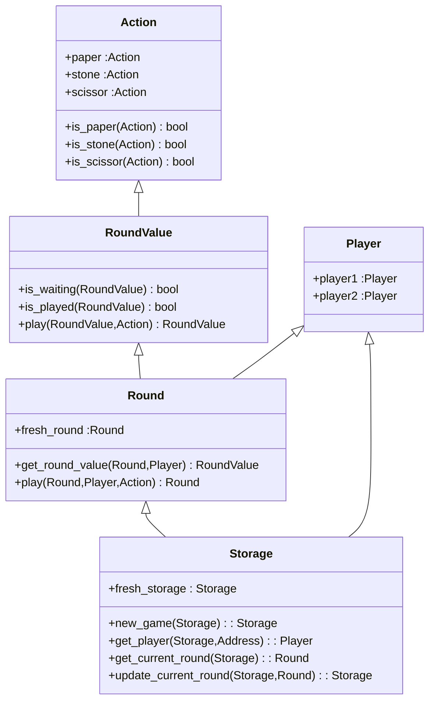
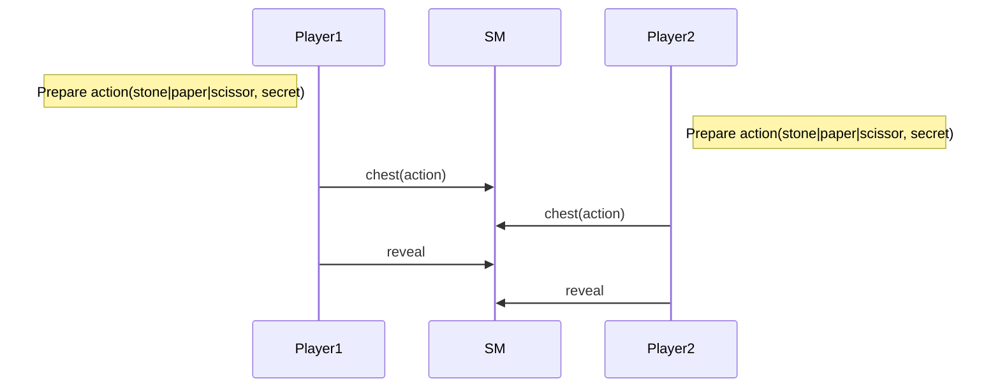
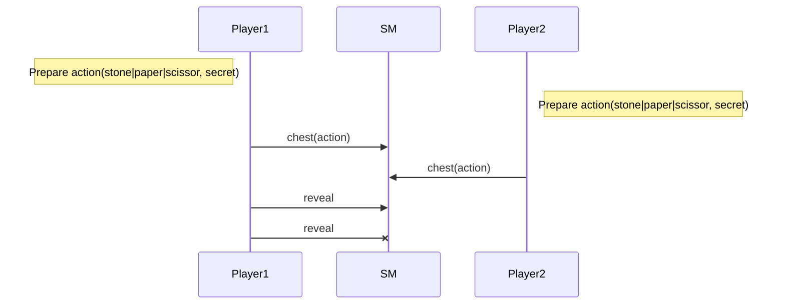

Training Shifumi dapp
===

> dapp : A decentralized application (dApp) is a type of distributed open source software application that runs on a peer-to-peer (P2P) blockchain network rather than on a single computer. DApps are visibly similar to other software applications that are supported on a website or mobile device but are P2P supported

Goal of this training is to develop a shifumi game with smart contract. You will learn : 
- create a smart contract in jsligo,
- use specific chest functionality,
- apply a TDD (Test driven development) approach.

# Prerequisites

## Remote execution

## Local execution

Please install this software first on your machine or use online alternative : 

- [ ] [VS Code](https://code.visualstudio.com/download) : as text editor
- [ ] [ligo](https://ligolang.org/docs/intro/installation/) : high level language that's transpile to michelson low level language and provide lot of development support for Tezos

# V1 

## Game rule

> We propose an implementation for only two players in order to simplify some algorithms.

The gameplay is simple. Each player choose to play `stone`, `paper` or `scissor` and that's all!

## Nominal sequence diagram

## Prohibited sequences

### Cannot play twice

## Smart contract

# V2 A fair game!

The gameplay is done in two stages. The first one each player choose to play `stone` or `paper` or `scissor`
and cipher it thanks to the `chest` functionality provided by the Tezos protocol.

> [Chest in Tezos]()

The second one each player reveal his choice sending the `chest_key` and the `secret` used for the ciphering.
Of course a player cannot reveal its choice since the other one did not play.

## Nominal sequence diagram

## Prohibited sequences

### Cannot reveal when another player did not play

### Cannot play twice

### Cannot reveal twice

## Smart contract

# V3 Time to Bet!

In this third version each player should engage 1tez each time they decide to play an action.

