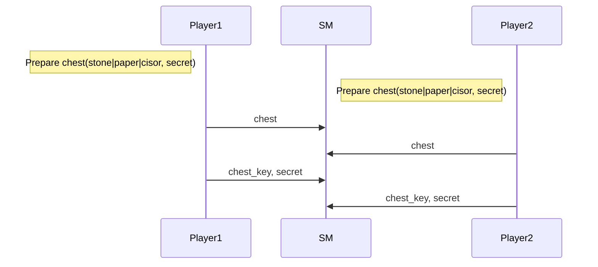

Training Shifumi dapp
===

> dapp : A decentralized application (dApp) is a type of distributed open source software application that runs on a peer-to-peer (P2P) blockchain network rather than on a single computer. DApps are visibly similar to other software applications that are supported on a website or mobile device but are P2P supported

Goal of this training is to develop a shifumi game with smart contract. You will learn : 
- create a smart contract in jsligo,
- use chest functionality,
- apply a TDD (Test driven development) approach.

# 

Shifumi nominal sequence diagram


# Prerequisites

Please install this software first on your machine or use online alternative : 

- [ ] [VS Code](https://code.visualstudio.com/download) : as text editor
- [ ] [ligo](https://ligolang.org/docs/intro/installation/) : high level language that's transpile to michelson low level language and provide lot of development support for Tezos

# Smart contract

## Step 1 : Create folders & files

```bash
mkdir smartcontract
touch ./shifumi/contract/main.jsligo
touch ./shifumi/test/test.jsligo
```

## Step 2 : Edit main.jsligo

Add the `Storage` namespace, the parameter type and finally the `main` function.

```ligo
export namespace Storage {
    export type action = ["Stone"] | ["Paper"] | ["Cisor"];

    export type t = unit;

    export const create = ([player1, player2]:[address, address]) : t => {
      return failwith("TODO");
    };

    export const new_game = ([storage, player1, player2]:[t, address, address]) : t => {
      return failwith("TODO");
    };

    export const play = ([storage, player, chest]:[t, address, chest]) : t => {
      return failwith("TODO");
    };

    export const reveal = ([storage, player, chest_key, secret]:[t, address, chest_key, nat]) : t => {
      return failwith("TODO");
    };
};

export type parameter = 
  ["Reset", [address, address]] 
| ["Play", chest] 
| ["Reveal", [chest_key, nat]];

export const main = ([parameter,storage]:[parameter, Storage.t]) : [list<operation>, Storage.t] => {
    const new_storage = match(parameter, {
        Reset : (p:[address,adress]) => Storage.new_game(storage, p[0], p[1]),
        Play : (p:chest) => Storage.play(storage, Tezos.sender, p),
        Reveal : (p:[chest_key, nat]) => Storage.reveal(storage, Tezos.sender, p[0], p[1]),
    });
    return [list([]) as list<operation>, new_storage];
};
```

Every contract requires :
- an entrypoint, **main** by default, with a mandatory signature taking 2 parameters and a return : 
    - **parameter** : the contract `parameter`
    - **storage** : the on-chain storage (can be any type, here `unit` by default)
    - **return_** : a list of `operation` and a storage

> Doc :  https://ligolang.org/docs/advanced/entrypoints-contracts

>:warning: You will notice that jsligo is a javascript-like language, multiple parameter declaration is a bit different.
You have to separate variable name to its type declaration this way : `([action, store] : [parameter, storage])`

Simple pattern matching is an important feature in Ligo. We need a switch on the entrypoint function to manage different actions. 
We use `match` to evaluate the parameter and call the appropriated `poke` function
> Doc https://ligolang.org/docs/language-basics/unit-option-pattern-matching

```ligo
    match (action, {
        Reset  : (p:[address,adress]) => Storage.new_game(storage, p[0], p[1]),
        Play   : (p:chest)            => Storage.play(storage, Tezos.sender, p),
        Reveal : (p:[chest_key, nat]) => Storage.reveal(storage, Tezos.sender, p[0], p[1]),
    } 
```

`Reset`, `Play` and `Reveal` are `parameters` from a `variant` type. It can be expressed 
by the following type:

```ligo
export type parameter = ["Reset", address, address] | ["Play", chest] | ["Reveal", chest_key, nat];
```

> Doc https://ligolang.org/docs/language-basics/unit-option-pattern-matching#variant-types
