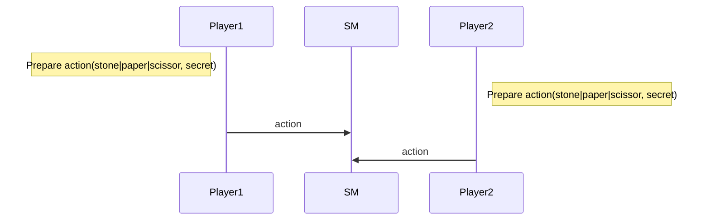
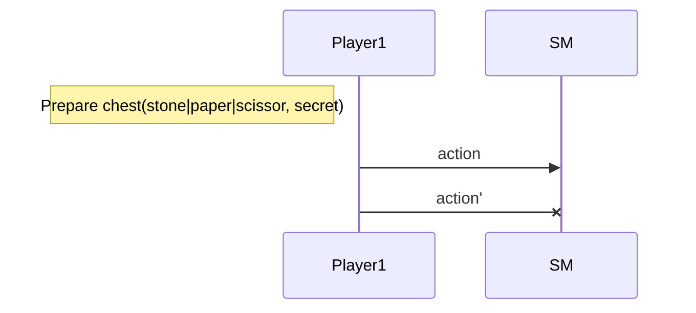
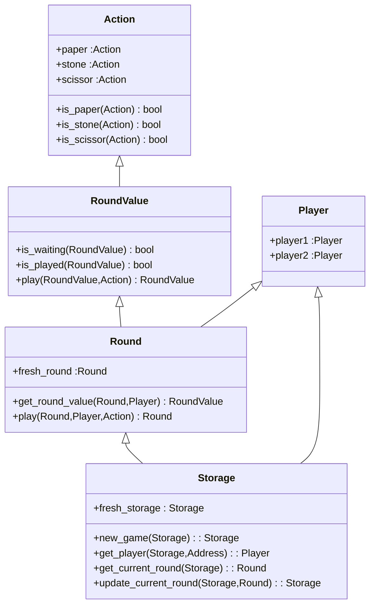

Training Shifumi dapp V1
===

# A basic approach

> We propose an implementation for only two players in order to simplify some algorithms.

The gameplay is simple. Each player choose to play `stone`, `paper` or `scissor` and that's all!

## Nominal sequence diagram

## Prohibited sequences

### Cannot play twice

## Smart contract

