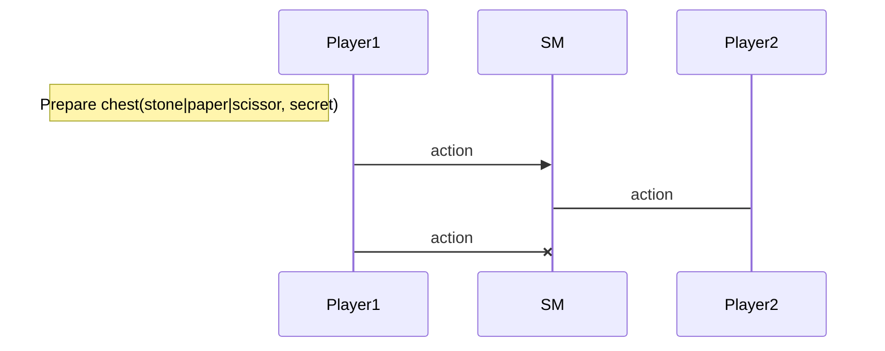

Training Shifumi dapp V1
===

# A basic approach

> We propose an implementation for only two players in order to simplify some algorithms.

The gameplay is simple. Each player choose to play `stone`, `paper` or `scissor` and that's all!
And when each player has played we can conclude thz round.

For this purpose we identity different sequence diagrams.

## Nominal sequence diagram


## Prohibited sequences

### Cannot play twice




### Cannot conclude before the end of the game


## Smart contract data types proposition


## Howto ?

Thanks to the test most of the implementation can be done thanks to the 
current tests suite. 

```sh
training-shifumi ➤ cd v1                                                                                                                             git:main*
v1 ➤ make 
[Testing] v1

Test failed with "Predicate checking if the action is paper"
Trace:
File "test/../lib/action.jsligo", line 12, characters 4-57:

File "test/t01_action.jsligo", line 7, characters 23-52 ,
File "test/common/check.jsligo", line 27, characters 41-48 ,
File "test/common/check.jsligo", line 27, characters 4-52 ,
File "test/t01_action.jsligo", line 48, character 14 to line 50, character 3
make: *** [all] Error 1
```

Open the file `lib/action.jsligo` and write the expected code and iterate.

## Retrospective ...

The current implementation is quite easy and natural but it's a good solution.

In the `t05_shifumi.jsligo` add the following test:

````
const why_this_solution_is_not_a_good_one = () : unit => {
    const get_contract_address = (storage:Contract.Storage.t) : typed_address<Contract.parameter, Contract.Storage.t> => {
        const originated = Test.originate(Contract.main, storage, 0 as tez);
        return originated[0] as typed_address<Contract.parameter, Contract.Storage.t>;
    };

    const get_contract = (address:typed_address<Contract.parameter, Contract.Storage.t>) : contract<Contract.parameter> => {
        return Test.to_contract(address) as contract<Contract.parameter>; 
    };

    const contract_address = get_contract_address(Contract.Storage.initial_game(alice.address, bob.address));
    const contract = get_contract(contract_address);

    Test.set_source(alice.address);
    const material = Action.paper;
    const _ = Test.transfer_to_contract(contract, Play(material), 10 as tez);

    Test.log(Test.get_storage(contract_address));

}

const test_why_this_solution_is_not_a_good_one = why_this_solution_is_not_a_good_one ();
```
