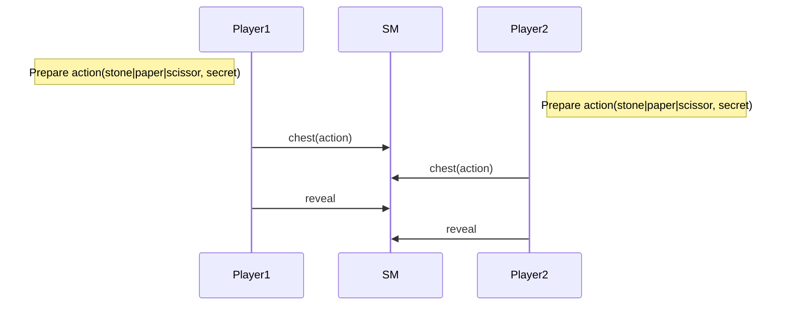
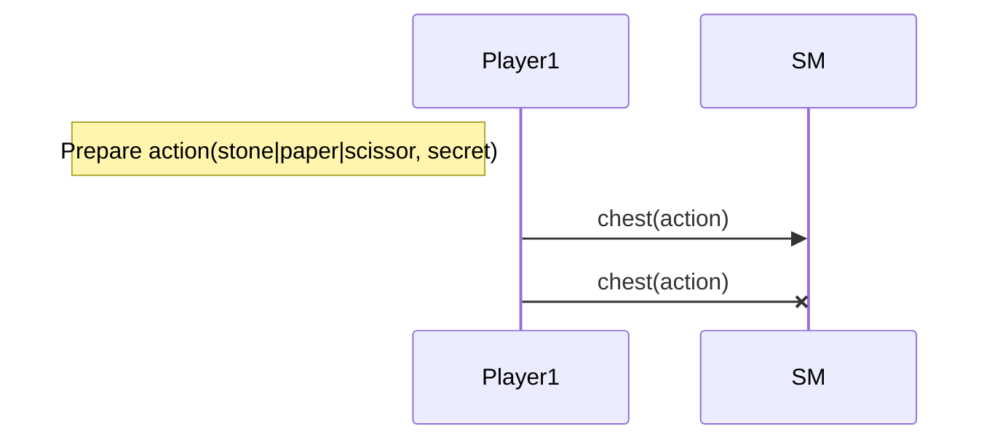
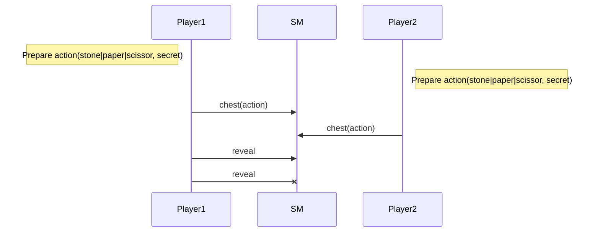

Training Shifumi dapp V2
===

# A fair game!

The gameplay is done in two stages. The first one each player choose to play `stone` or `paper` or `scissor`
and cipher it thanks to the `chest` functionality provided by the Tezos protocol.

> [Chest in Tezos]()

The second one each player reveal his choice sending the `chest_key` and the `secret` used for the ciphering.
Of course a player cannot reveal its choice since the other one did not play.

## Nominal sequence diagram

## Prohibited sequences

### Cannot reveal when another player did not play

### Cannot play twice

### Cannot reveal twice

