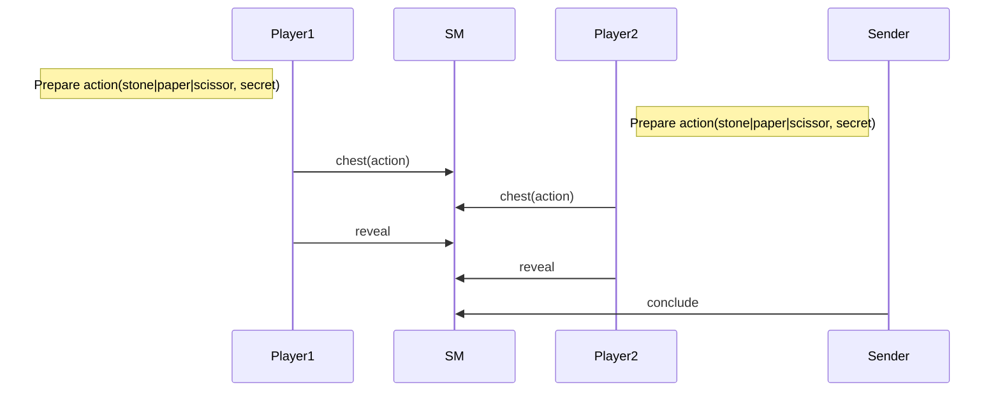
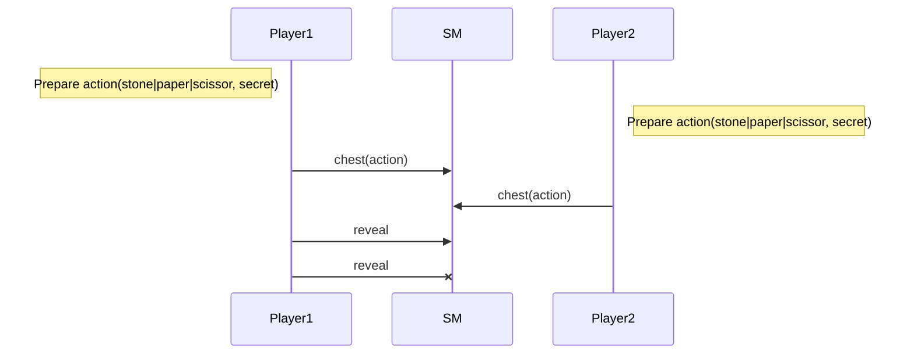
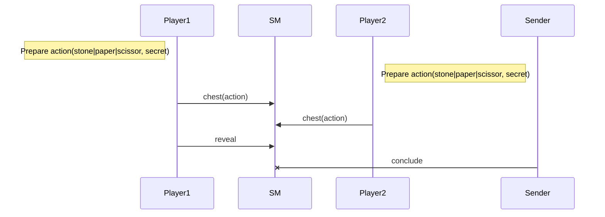
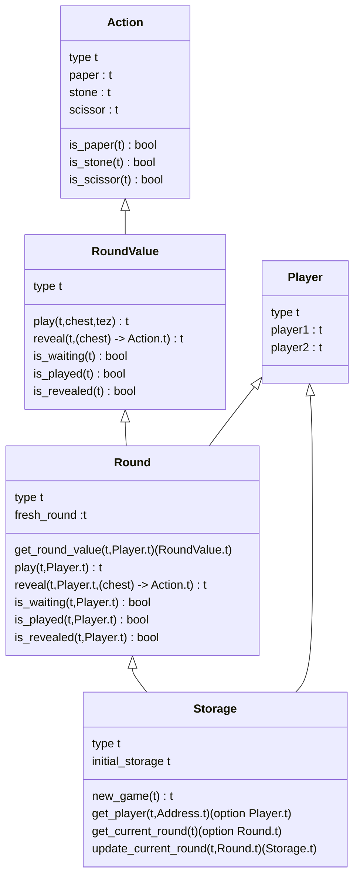

Training Shifumi dapp V2
===

# A fair game!

In order to have a fair game the gameplay is done in two stages. The first one each player 
choose to play `stone` or `paper` or `scissor` and cipher it thanks to the `chest` functionality 
provided by the Tezos protocol. So compared to v1 instead of sending directly the action value 
the player send its encrypted value.

> [Chest in Tezos](https://tezos.gitlab.io/alpha/timelock.html)

Each player can reveal his choice sending the `chest_key` and  the `secret` used for the ciphering. 
Of course a player cannot reveal its choice since the other one did not play. When each player has 
revealedwe can can conclude.

We start from the solution designed for the simple approach i.e. v1. First we review the initial sequence diagrams. 

## Nominal sequence diagram



## Additional Prohibited sequences

### Cannot reveal when another player did not play

We should avoid earlier play revelation.


### Cannot reveal twice



### Cannot conclude when round is not completed



## Howto?

The implementation can be done thanks to the proposed tests suite. 

```sh
training-shifumi ➤ cd v2
v1 ➤ make 
[Testing] test/t01_action.jsligo
("✅" , {expected = true})
("✅" , {expected = false})
("✅" , {expected = false})
("✅" , {expected = false})
("✅" , {expected = true})
("✅" , {expected = false})
("✅" , {expected = false})
("✅" , {expected = false})
("✅" , {expected = true})
Everything at the top-level was executed.
- tests exited with value ().
[Testing] test/t02_round_value.jsligo
("✅" , {expected = true})
("✅" , {expected = false})

Test failed with "Predicate checking if the round_value is revealed"
Trace:
File "test/../lib/round_value.jsligo", line 25, characters 4-65:

File "test/t02_round_value.jsligo", line 21, characters 23-65 ,
File "test/common/check.jsligo", line 27, characters 41-48 ,
File "test/common/check.jsligo", line 27, characters 4-52 ,
File "test/t02_round_value.jsligo", line 102, character 14 to line 104, character 3
make: *** [test/t02_round_value.dummy] Error 1
```

Once again go through each file where implementation is required and propose an implementation.

## Smart contract data types


