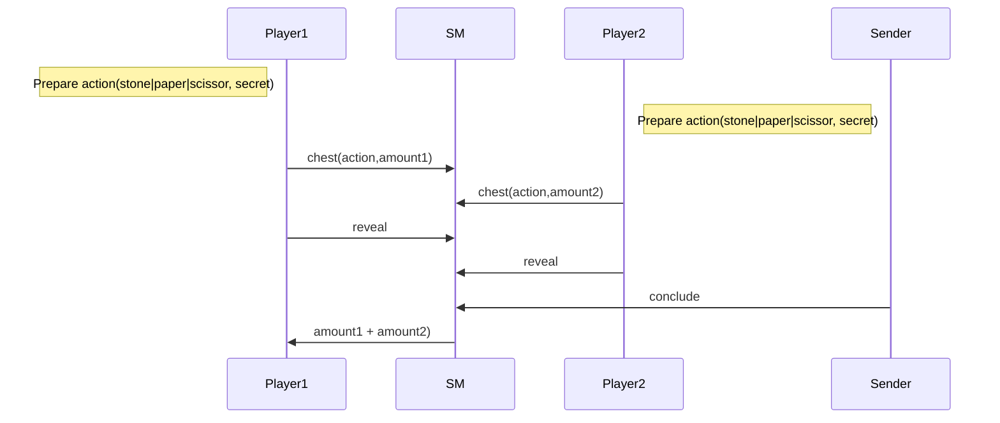
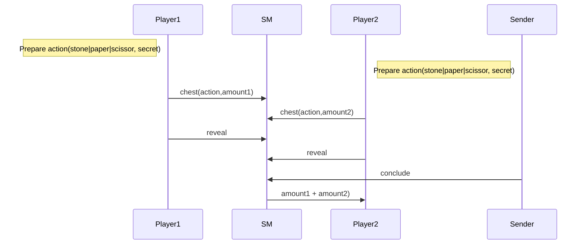
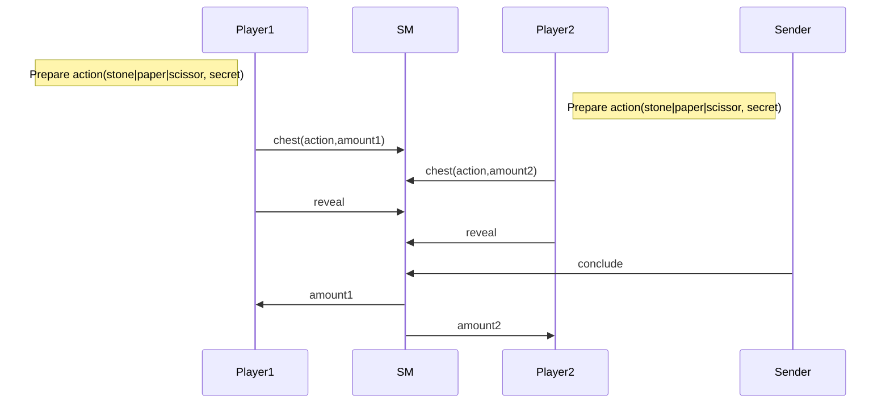
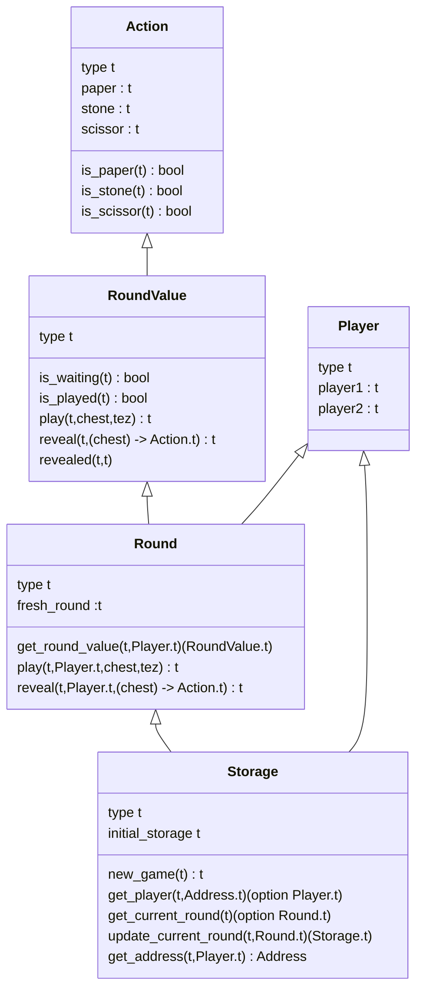

Training Shifumi dapp V3
===

# Time to bet!

In this last version, players should bet exactly 10 tez if they want to `play`. 
When the round has been revealed, the `conclude` action solves the round and gives
back the betting to the winner or send back the played tez to each player in case 
of a draw.

## Nominal sequence diagram

### Player1 wins



### Player2 wins


### Draw



### Round Value review

Since we accept tez for the betting we should manage this information during the
round each time a player decides to play. For this purpose, the RoundValue play
should be revisited by implementing this management.

Finally, for given two `RoundValues` we would like to retrieve each player its action 
and the betting amount thanks to the `retrieved` function.

## Storage review

Since we have to send the price to the winner we need a function able to retrieve the
address for a given player.

## Howto?

The implementation can be done thanks to the proposed tests suite. 

```sh
training-shifumi ➤ cd v2
v1 ➤ make 
[Testing] test/t01_action.jsligo
("✅" , {expected = true})
("✅" , {expected = false})
("✅" , {expected = false})
("✅" , {expected = false})
("✅" , {expected = true})
("✅" , {expected = false})
("✅" , {expected = false})
("✅" , {expected = false})
("✅" , {expected = true})
Everything at the top-level was executed.
- tests exited with value ().
[Testing] test/t02_round_value.jsligo
("✅" , {expected = true})
("✅" , {expected = false})
("✅" , {expected = false})

Test failed with "Should provide a play action for a given round_value and chest"
Trace:
File "test/../lib/round_value.jsligo", line 36, characters 4-78:

File "test/t02_round_value.jsligo", line 32, characters 28-77 ,
File "test/common/check.jsligo", line 27, characters 41-48 ,
File "test/common/check.jsligo", line 27, characters 4-52 ,
File "test/t02_round_value.jsligo", line 102, character 14 to line 104, character 3
make: *** [test/t02_round_value.dummy] Error 1
```

Once again go through each file where implementation is required and propose an implementation.

## Smart contract data types


