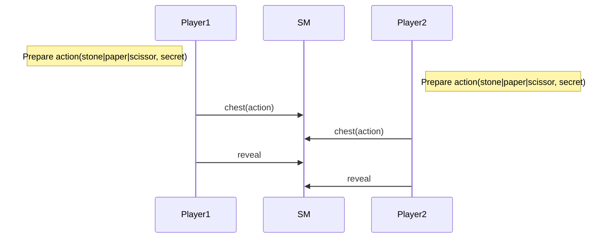
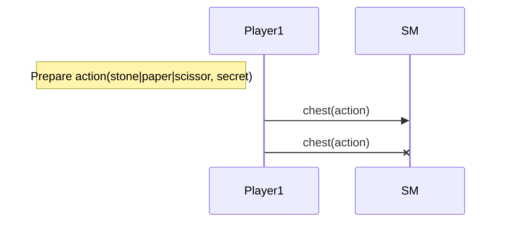
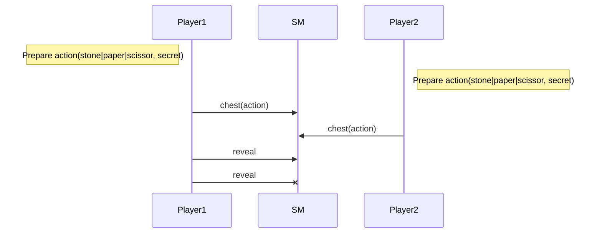
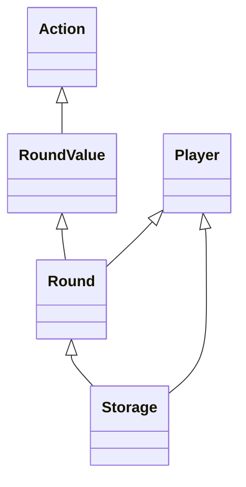

Training Shifumi dapp V4
===

# Time to bet!

The gameplay is done in two stages. The first one each player choose to play `stone` or `paper` or `scissor`
and cipher it thanks to the `chest` functionality provided by the Tezos protocol.

> [Chest in Tezos]()

The second one each player reveal his choice sending the `chest_key` and the `secret` used for the ciphering.
Of course a player cannot reveal its choice since the other one did not play. When each player has revealed
we can can conclude.

## Nominal sequence diagram



## Prohibited sequences

### Cannot reveal when another player did not play


### Cannot play twice



### Cannot reveal twice



## Smart contract data types



```
class Action{
  paper :Action
  stone :Action
  scissor :Action
  is_paper(Action) bool
  is_stone(Action) bool
  is_scissor(Action) bool
}
        
class Player{
  player1 :Player 
  player2 :Player
}

class RoundValue{
  is_waiting(RoundValue) bool
  is_played(RoundValue) bool
  play(RoundValue,chest,tez) RoundValue
  reveal(RoundValue,(chest) -> Action.t) RoundValue
  revealed(RoundValue,RoundValue) option<{player1:[Action.t,tez],player2:[Action.t,tez]}>
}

class Round{
  fresh_round :Round
  get_round_value(Round,Player) RoundValue
  play(Round,Player,chest,tez) Round
  reveal(Round,Player,(chest) -> Action.t) RoundValue
}

class Storage{
  fresh_storage Storage
  new_game(Storage) Storage
  get_player(Storage,Address) option<Player>
  get_current_round(Storage) option<Round>
  update_current_round(Storage,Round) Storage
  get_address(Storage,Player) Address
}
```
