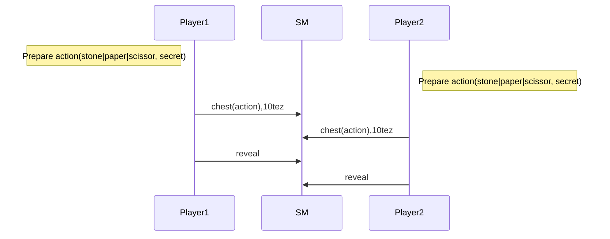
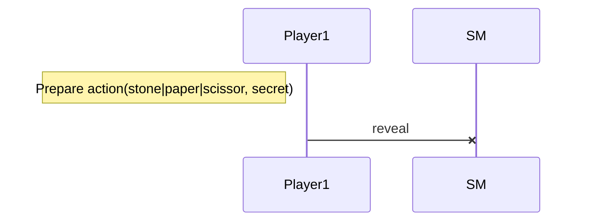
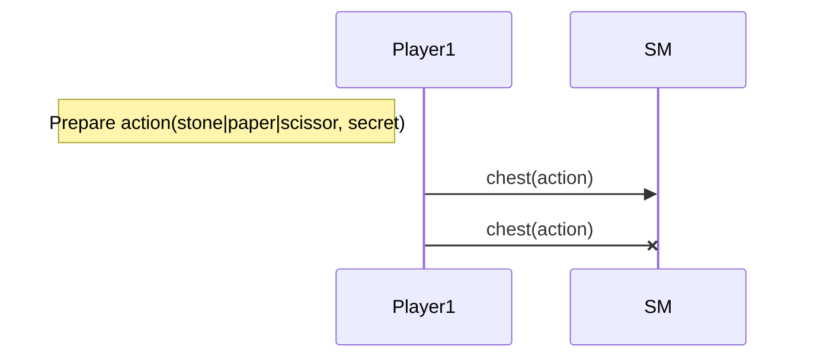
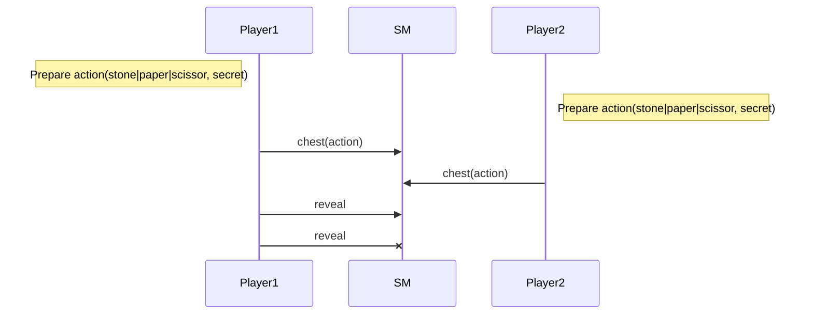
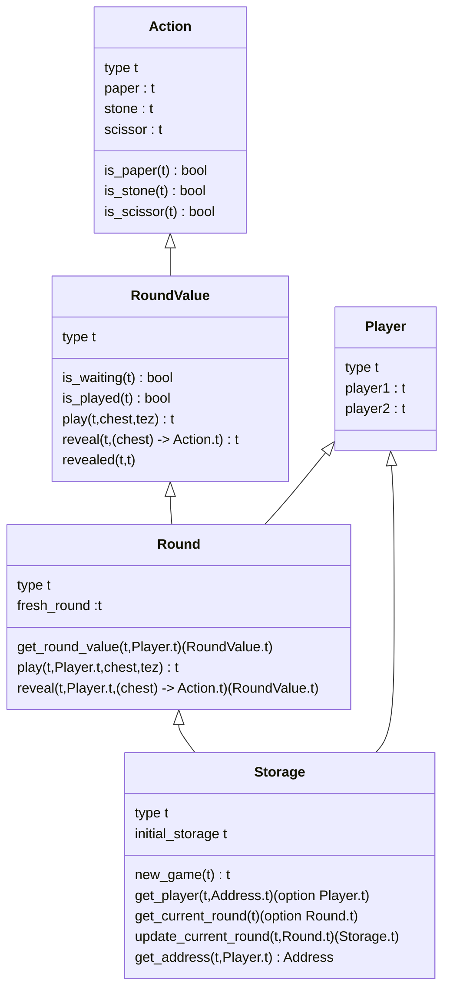

Training Shifumi dapp V3
===

# Time to bet!

In this last version, players should bet exactly 10 tez if they want to play. 
When the round has been revealed, the conclude action solves the round and give
back the bet to the winner or send back the played tez to each player.

## Nominal sequence diagram

## Prohibited sequences

### Cannot reveal when another player did not play

### Cannot play twice

### Cannot reveal twice

## Smart contract data types

